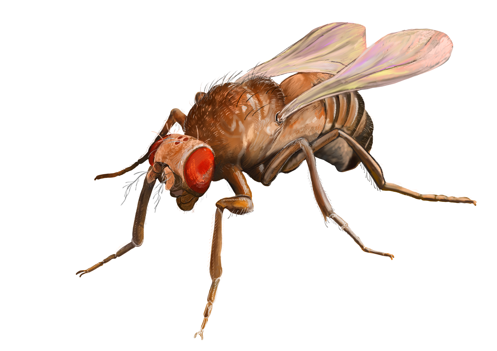

# FastFly

GPU-accelerated simulator for the complete *Drosophila melanogaster* (fruit fly) brain connectome — 139,255 neurons and 54.5 million synapses — targeting real-time or faster performance on a single consumer NVIDIA GPU.



## How it works

- **Neuron model:** Leaky Integrate-and-Fire (LIF), validated by [arXiv:2404.17128](https://arxiv.org/abs/2404.17128)
- **Connectivity:** CSR sparse format with FP16 synaptic weights
- **Spike propagation:** Push model — only processes synapses of neurons that actually fired
- **Spike detection:** Warp ballot intrinsics for bit-packed spike flags
- **Load balancing:** Warp-per-spike with grid-stride loop

Connectome data comes from [FlyWire materialization v783](https://github.com/philshiu/Drosophila_brain_model) (Shiu et al. 2024, *Nature*).

## Requirements

- **CUDA path (C++):** NVIDIA CUDA Toolkit 12.x
- **Python path:** Python 3.10+, [CuPy](https://cupy.dev/) (`pip install cupy-cuda12x`)
- **Web visualizer:** FastAPI, uvicorn (`pip install fastapi uvicorn[standard]`)

## Quick start

### 1. Download the connectome

```bash
pip install pandas pyarrow numpy requests
python download_connectome.py
```

This downloads the FlyWire v783 data and produces `flywire_v783.bin`.

### 2a. Run the CUDA simulator (C++)

```bash
build.bat                               # compile (requires nvcc)
flywire_sim.exe --data flywire_v783.bin  # run with real connectome
flywire_sim.exe                          # or run with synthetic data
```

### 2b. Run the Python/CuPy simulator

```bash
pip install cupy-cuda12x
python flywire_sim.py --data flywire_v783.bin
python flywire_sim.py                    # synthetic data fallback
```

### 3. Web visualizer

```bash
pip install fastapi uvicorn[standard]
python app_server.py --data flywire_v783.bin
# Open http://127.0.0.1:8000
```

## Project structure

| File | Description |
|---|---|
| `flywire_sim.cu` | Standalone CUDA C++ simulator |
| `flywire_sim.py` | Python/CuPy simulator (runtime-compiled CUDA kernels, no Visual Studio needed) |
| `sim_engine.py` | Simulation engine used by the web server |
| `app_server.py` | FastAPI web server with WebSocket-based live visualizer |
| `download_connectome.py` | Downloads FlyWire v783 data and converts to binary format |
| `download_metadata.py` | Downloads neuron annotation metadata |
| `build.bat` | Build script for the C++ simulator (targets RTX 3080 Ti / SM 8.6) |

## License

MIT
